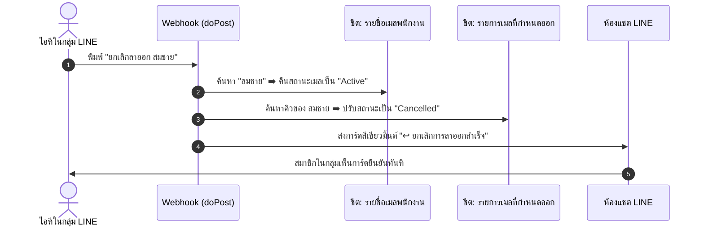
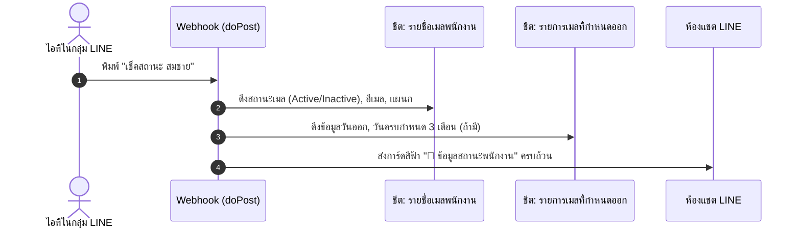
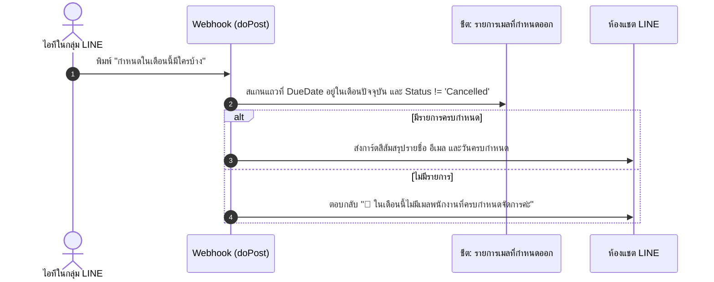
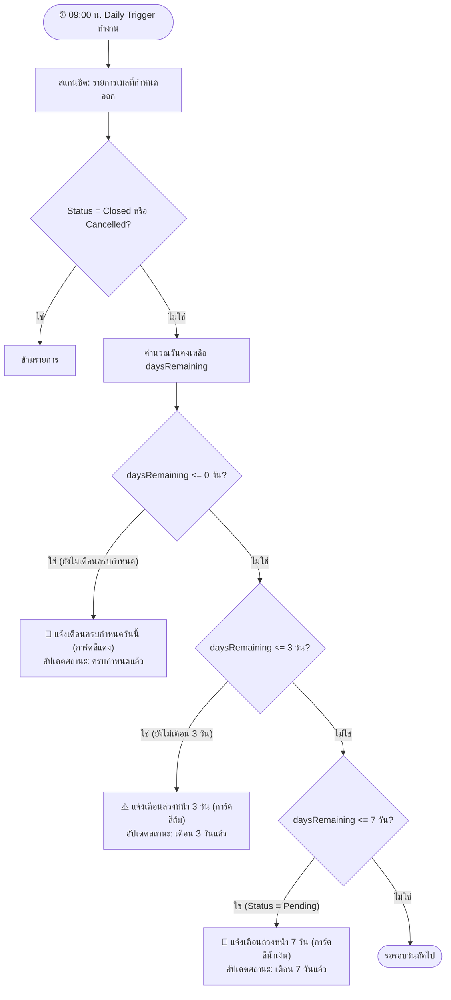

# แผนภาพกระบวนการทำงานและคำสั่งทั้งหมด (Workflow & Command Center)

เอกสารสรุปคำสั่งและผังการทำงานทั้งหมดของระบบสำหรับคุณเอกค่ะ

---

## 🎮 สรุปคำสั่งที่ใช้งานได้ในกลุ่ม LINE

```text
┌────────────────────────────────────────────────────────────────────────┐
│  🤖 คำสั่งที่ไอทีสามารถพิมพ์สั่งงานได้ทันที:                           │
├────────────────────────────────────────────────────────────────────────┤
│  1. เมนู / คำสั่ง              👉 แสดงการ์ดแนะนำฟังก์ชันทั้งหมด         │
│  2. [ชื่อ] มีกำหนด ลาออก [วัน]  👉 แจ้งลาออก ปรับ Inactive + คิว 3 เดือน│
│  3. ยกเลิก [ชื่อ]              👉 คืนสถานะ Active + ยกเลิกคิว          │
│  4. เช็คสถานะ [ชื่อ]           👉 ดูสถานะเมลปัจจุบัน + คิวลาออก        │
│  5. กำหนดในเดือนนี้มีใครบ้าง   👉 สรุปรายชื่อที่ครบกำหนดในเดือนนี้     │
│  6. getid                      👉 เช็ค Group ID / User ID              │
└────────────────────────────────────────────────────────────────────────┘
```

---

## 🔄 1. ผังการทำงานเมื่อ "ยกเลิกลาออก" (Cancel Resignation)



---

## 🔄 2. ผังการทำงานเมื่อ "เช็คสถานะพนักงาน" (Check Status)



---

## 🔄 3. ผังการทำงานเมื่อ "ตรวจเช็ครายการในเดือนนี้" (Due This Month)



---

## ⏰ 4. ผังการทำงานระบบแจ้งเตือนอัตโนมัติประจำวัน (Daily Trigger: 3 ระยะ)

ระบบตั้งเวลาตรวจเช็คทุกวันเวลา 09:00 น. (`checkResignedEmailsAndNotify`) โดยจะส่ง Push Message เข้าห้องแชตกลุ่มไอทีตามระยะเวลาที่เหลือ:


